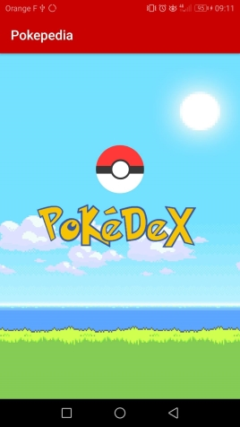
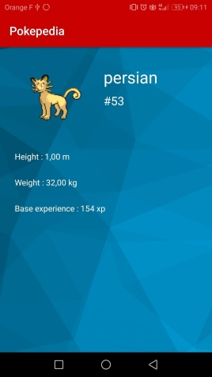

# Pokepedia

## Présentation

Application mobile codée en Java, utilisant l'architecture MVC.

L'application affiche la liste de tous les Pokémon existants et leurs détails. Les informations sont récupérées sur une API.

## Prérequis

- Installation d'Android Studio
- RecyclerView
- Projet déposé sur github
- Appels vers une API REST
- Stockage en cache avec les SharedPreferences

````
https://github.com/LaetitiaBod/Pokepedia
````
## Consignes respectées

- Deux écrans minimum : un avec une liste, un avec le détail d'un élément
- Appel WebService à une API Rest
- Stockage des données en cache
- Fonctionnalités supplémentaires :
	- Architecture MVC
	- Gitflow
	- Animation entre écrans
	- Ecran d'accueil

## Fonctionnalités

### Ecran d'accueil

- Simple menu avec un bouton pour passer à l'écran suivant




### Ecran de la liste

- Liste des 807 Pokémon existants


### Ecran du détail

- Affichage en détail d'un Pokémon. Caractéristiques choisis : nom, numéro de Pokédex, taille, poids, expérience de base.



## Problèmes, remarques

- Les images ne sont pas affichées pour les Pokémon de la liste
- Les SharedPreferences enregistrent uniquement le dernier détail cliqué (et la liste)
- Certains Pokémon n'ont pas d'image (en particulier, à partir de 803)
